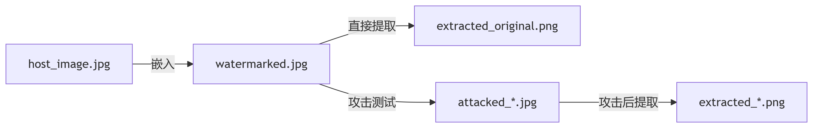

### 基于数字水印的图片泄露检测

程序实现了基于DCT频域的图像数字水印技术，能够在图像中嵌入不可见水印，并能抵抗常见的图像处理攻击，并对水印进行了提取和鲁棒性测试。

DCT频域处理原理：首先进行色彩空间转换，将RGB图像转换为YUV空间，仅对亮度通道Y进行操作；然后分块处理，将Y通道分为$8×8$像素块，每个块独立进行DCT变换；接着水印嵌入；最后逆变换重构，对每个块进行IDCT逆变换，合并所有块并转换回RGB空间。

使用嵌入的逆向过程对水印进行提取。

最后进行了鲁棒性测试，包含了，几何攻击：翻转、平移、旋转、裁剪；信号处理：噪声添加、JPEG压缩；亮度调整：对比度增强。

主要的文件关系如下：



得到程序的运行结果：
```
鲁棒性测试结果:
----------------------------------------
攻击类型            | PSNR (dB)  | SSIM  
----------------------------------------
flipped         | 15.31      | 0.9110
translated      | 10.83      | 0.8285
cropped         | 10.20      | 0.8171
contrast        | inf        | 1.0000
noisy           | 11.03      | 0.8385
jpeg            | 0.66       | 0.0381
rotated         | 10.09      | 0.8162
----------------------------------------
```

可以看到水印的抗鲁棒性良好。